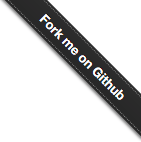
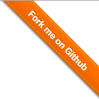
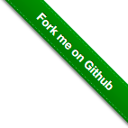

# github-fork-ribbon

> A native JavaScript plugin that automatically adds fork github buttons to your web pages.Simple but powerful!

## Version

### v0.1.0
* After you generate ribbon, you can also recanfigure parameters

### v0.2.0（latest）
* Style has big change, more customizable
* If you have '.github.io' in hostname, you can generate ribbon without canfiguration

## Features
`github-fork-ribbon` is a native JavaScript plugin that does not have any dependences, and has the following features:

* Support custom button styles

* Can automatically match [Github Pages](https://pages.github.com/)

* Support multiple operations for ribbon

* Support the CMD and AMD specifications

## Usage

* Download：

[Download the latest version](http://github.com/merrier/github-fork-ribbon/archive/master.zip)

* Refer to the following javascript file：

```html
<script src='github-fork-ribbon.js'></script>
```

Then you can generate fork buttons for your web pages in three ways:

* The way an instance of `new` is followed by a simple example(followed by the meaning of the parameters):

```javascript
var fg = new githubFork({
    type: 'orange',
    url: 'http://github.com/merrier/',
});
```

* If your website is constructed through [Github Pages](https://pages.github.com/), that is to say if your current `location.hostname` is the `XXXX.github.io` form, the plugin will automatically and a fork button in the upper right corner of the page, pointing to your Github address;of course, you can also make more coordination through the above way

* If you only need the default style and location, but not built by `Github Pages`, you can also use the plugin directly by adding query to your URL, as in the form of query:

```bash
&githubFork=your-github-name
```

## Documentation

`github-fork-ribbon` will first determine whether the current URL contains `.github.io`hostname or query`githubFork=your-github-name`. If the two cases are met, a button is generated by default; otherwise, a githubFork instance of new is called, similar to the following example:

```js
var gf = new githubFork({
    text: 'Fork me on Github',
    url: '//github.com/merrier/',
    position: ['left', 'top'],
    type: 'red',
    zIndex: 2,
    fixed: false,
    target: '_top',
    fontSize: '14px',
    isMobileHide: true,
})
```

### Configuration

#### text: String

> default: 'Fork me on Github'

The text of the button is not added long hidden function(v0.2.0), so please do not set too long characters

#### url: String

> default: '//github.com/merrier/',

Button jump link

#### position: Array

> default: ['right', 'top']

Button position. It is divided into four categories: `upper right`, `upper left`, `lower right`, `lower left`, and make sure that the configuration item is an array of these four positions

#### type: String

> default: 'black'

The color type of the button is provided by default with four colors (v0.2.0), `black`, `red`, `orange`, and `green`, as shown in the following table:

|             black            |           red            |              orange            |             green            |
|:----------------------------:|:------------------------:|:------------------------------:|:----------------------------:|
|  |  |  |  |

#### zIndex: Number

> default: 2

The z-index property of the button

#### fixed: Boolean

> default: false

Whether the position property of the button is fixed

#### target: String

> default: '_blank'

Where to open the link document, there are four kinds:'_blank','_top','_parent','_self', consistent with the target attribute of the <a> tag

#### fontSize: String

> default: '13px'

The font size of the button. When the font changes, the size of the button itself will also changes

#### isMobileHide: Boolean

> default: 'true'

While hide the button while accessing the phone


# github-fork-ribbon

> 一个自动为你的网页添加fork按钮的原生javascript插件，简单实用！

## 版本说明

### v0.1.0
* 生成ribbon之后可重新配置参数

### v0.2.0（最新）
* 样式大变样，可定制化选项更多
* 如果hostname中有'.github.io'，将不需配置即可生成ribbon

## 特色
github-fork-ribbon是原生javascript插件，不依赖任何库，同时具有以下特色：

* 支持自定义fork按钮样式

* 可以自动匹配[Github Pages](https://pages.github.com/)

* 支持多种对于ribbon的操作

* 支持CMD、AMD规范

## 用法

* 下载：

[下载最新版本](http://github.com/merrier/github-fork-ribbon/archive/master.zip)

* 引用下面这个js文件：

```html
<script src='github-fork-ribbon.js'></script>
```

然后，你可以通过以下三种方式为你的网页生成fork按钮：

* new一个实例的方式，以下为一个简单示例（参数含义后面会介绍到）：

```javascript
var fg = new githubFork({
    type: 'orange',
    url: 'http://github.com/merrier/',
});
```

* 如果你的网页是通过[Github Pages](https://pages.github.com/)构建，那么如果你当前网页的`location.hostname`是`XXXX.github.io`的形式的话，插件将自动添加一个fork按钮到网页的右上角，同时指向为你的github地址；当然，你也可以通过上面的方式进行更多配置

* 如果你只需要默认的样式和位置，同时并不是通过Github Pages构建，那么你也可以通过添加query的形式直接使用插件，query的形式如下：

```bash
&githubFork=your-github-name
```

## 文档

`github-fork-ribbon`将首先判断当前URL中是否含有`.github.io`hostname或query`githubFork=your-github-name`，如果符合这两种情况，将默认生成一个按钮；否则需要new一个`githubFork`实例进行调用，类似于下面这种：

```js
var gf = new githubFork({
    text: 'Fork me on Github',
    url: '//github.com/merrier/',
    position: ['left', 'top'],
    type: 'red',
    zIndex: 2,
    fixed: false,
    target: '_top',
    fontSize: '14px',
    isMobileHide: true,
})
```
### 配置项

#### text: String

> default: 'Fork me on Github'

按钮的文本，因为没有加入过长隐藏的功能（0.2.0），所以请不要设置过长字符

#### url: String

> default: '//github.com/merrier/',

按钮跳转的链接

#### position: Array

> default: ['right', 'top']

按钮的位置，分为四种：右上、左上、右下、左下，请确保该配置项为这四种位置之一的数组

#### type: String

> default: 'black'

按钮的颜色类型，默认提供四种颜色（0.2.0），分别为黑色、红色、橘色和绿色，如下表所示：

|             black            |           red            |              orange            |             green            |
|:----------------------------:|:------------------------:|:------------------------------:|:----------------------------:|
|  |  |  |  |

#### zIndex: Number

> default: 2

按钮的z-index属性

#### fixed: Boolean

> default: false

按钮的position属性是否为fixed

#### target: String

> default: '_blank'

在何处打开链接文档，共有四种：'_blank'、'_top'、'_parent'、'_self'，与<a>标签的target属性一致

#### fontSize: String

> default: '13px'

按钮的字体大小，当字体改变时，按钮本身大小也会发生改变

#### isMobileHide: Boolean

> default: 'true'

在移动端访问时是否隐藏按钮